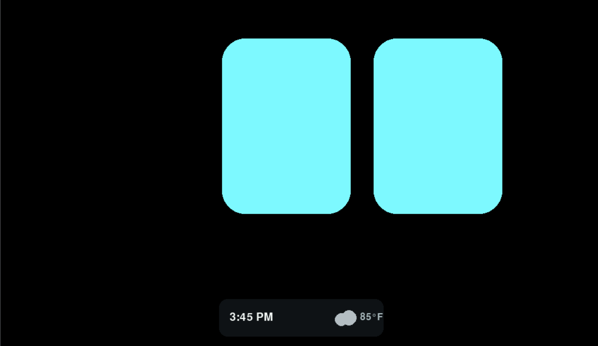
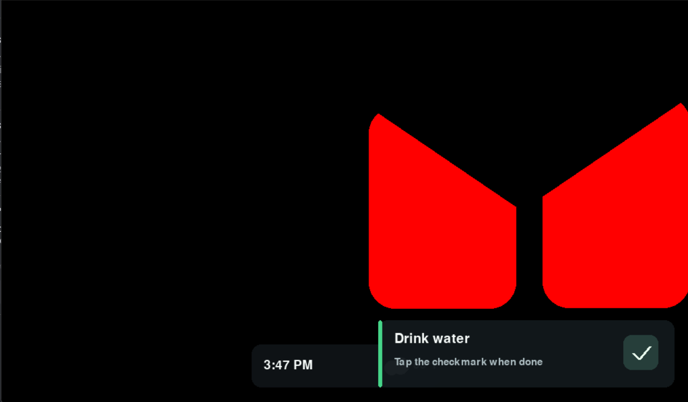
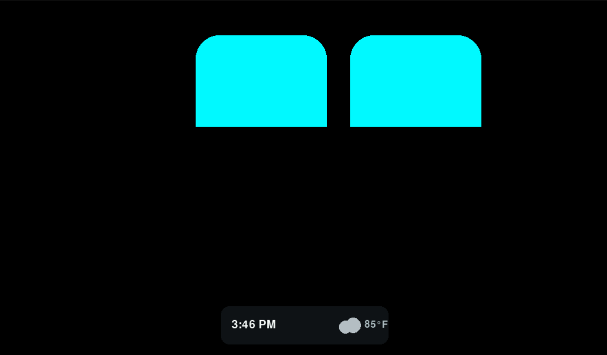
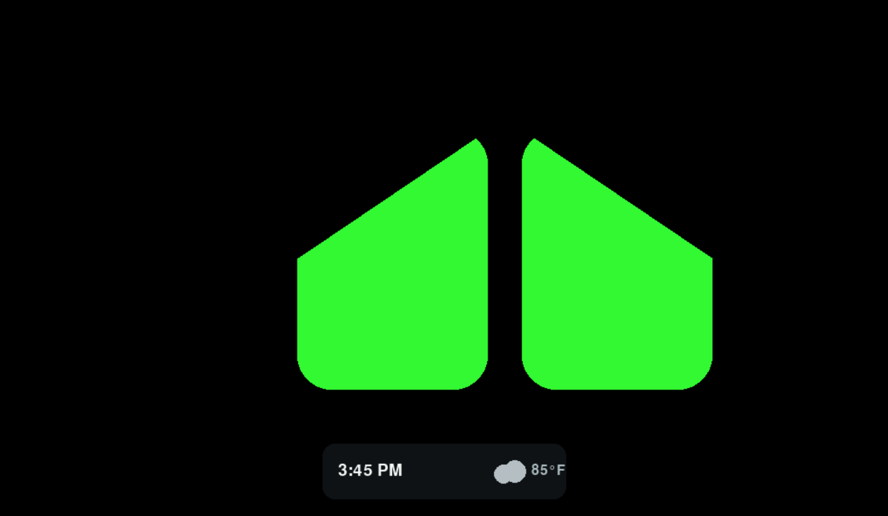

# DeskBuddy


 <br/>



Desk Buddy is a python based application meant for raspberry pi with a touch screen. It features:
- robotic eyes via a modified [RoboEyes](https://github.com/sofianhw/RoboEyes) library for visuals
- an API to send reminders, or modify DeskBuddy's default mood
- a status bar with current time and weather
- sound effects for new notifications, or DeskBuddy's movements

---

## Installation

1. Clone the repository:
   ```bash
   git clone https://github.com/EricTurner3/DeskBuddy.git
   ```
2. Install required dependencies:
   ```bash
   pip install pygame # or pygame-ce
   ```
3. Run:
   ```bash
   python main.py
   # use this on linux with no desktop to spawn GUI just for this app
   xinit /usr/bin/python3 /opt/DeskBuddy/main.py
   ```
4. For upgrading, load into the folder and run `git fetch --all && git reset --hard origin/main` to pull latest changes. This will discard any local changes you made!
---


## API Reference

When `main.py` is running, a local reminder API listens on `0.0.0.0:8765`.
Reminders are stored locally in `reminders.db` and due reminders appear as an animated
toast at the bottom of the display.

### Reminder API

Create a reminder with an ISO-8601 timestamp (UTC is assumed when no timezone
is included):

```bash
curl -X POST http://127.0.0.1:8765/reminders \
   -H 'Content-Type: application/json' \
   -d '{"title":"Take out the trash","due_at":"2026-08-28T18:00:00Z"}'
```

For quick integrations, use a delay in seconds instead:

```bash
curl -X POST http://127.0.0.1:8765/reminders \
   -H 'Content-Type: application/json' \
   -d '{"title":"Drink water","delay_seconds":3600}'
```

- `GET /reminders` lists incomplete reminders ordered by due time.
- `POST /reminders/{id}/complete` completes a reminder through the API.

The green checkmark on the toast completes the reminder and makes the eyes
happy briefly before returning them to the default mood.

---

## License

This project is licensed under the **GNU General Public License (GPL)**.

---

## Credits

- [RoboEyes](https://github.com/sofianhw/RoboEyes) - a python implementation using Pygame to create robotic eyes. 
    - this serves as the base for the animations, I made a few tweaks for DeskBuddy!
- Sounds
    - Focus 7.wav by theplax -- https://freesound.org/s/624927/ -- License: Attribution 4.0 
    - Focus 12.wav by theplax -- https://freesound.org/s/624916/ -- License: Attribution 4.0
    - Nikon D5200 Shutter Dial by mitkonikov -- https://freesound.org/s/400594/ -- License: Creative Commons 0