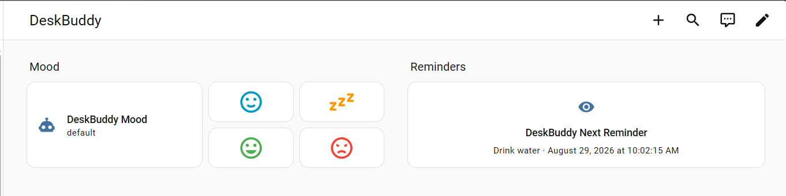

# HomeAssistant Integration


Control the robot's mood and see next reminder via HomeAssistant's UI

## configuration.yaml
```yaml
rest:
  - resource: "http://10.0.0.2:8765/mood"   # replace with DeskBuddy's actual LAN IP
    scan_interval: 15
    sensor:
      - name: "DeskBuddy Mood"
        unique_id: deskbuddy_mood
        value_template: "{{ value_json.mood }}"
        icon: mdi:emoticon-outline

  - resource: "http://10.0.0.2:8765/reminders"
    scan_interval: 15
    sensor:
      - name: "DeskBuddy Reminder Count"
        unique_id: deskbuddy_reminder_count
        value_template: "{{ value_json | length }}"
        unit_of_measurement: "reminders"

      - name: "DeskBuddy Next Reminder"
        unique_id: deskbuddy_next_reminder
        value_template: >-
          {{ value_json[0].title if value_json | length > 0 else "None" }}
        json_attributes_path: "$.0"
        json_attributes:
          - id
          - due_at

rest_command:
  deskbuddy_set_mood:
    url: "http://10.0.0.2:8765/mood"
    method: post
    content_type: "application/json"
    payload: '{"mood": "{{ mood }}"}'

  deskbuddy_create_reminder:
    url: "http://10.0.0.2:8765/reminders"
    method: post
    content_type: "application/json"
    payload: >-
      {"title": "{{ title }}", "delay_seconds": {{ delay_seconds | default(3600) }}}

  deskbuddy_complete_reminder:
    url: "http://192.168.1.50:8765/reminders/{{ reminder_id }}/complete"
    method: post
```

## dashboard.yaml
Create a new dashboard, then go to raw configuration editor and paste the following:
```yaml
views:
  - type: sections
    sections:
      - type: grid
        cards:
          - type: heading
            heading: Mood
            heading_style: title
          - type: tile
            entity: sensor.deskbuddy_mood
            icon: mdi:robot
            vertical: false
            features_position: bottom
            grid_options:
              columns: 6
              rows: 2
          - show_name: false
            show_icon: true
            type: button
            entity: sensor.deskbuddy_mood
            tap_action:
              action: perform-action
              perform_action: rest_command.deskbuddy_set_mood
              data:
                mood: default
              target: {}
            show_state: false
            icon: mdi:emoticon-happy-outline
            color: primary
          - show_name: false
            show_icon: true
            type: button
            entity: sensor.deskbuddy_mood
            tap_action:
              action: call-service
              service: rest_command.deskbuddy_set_mood
              service_data:
                mood: tired
            show_state: false
            icon: mdi:sleep
            color: accent
          - show_name: false
            show_icon: true
            type: button
            entity: sensor.deskbuddy_mood
            tap_action:
              action: call-service
              service: rest_command.deskbuddy_set_mood
              service_data:
                mood: happy
            show_state: false
            color: green
          - show_name: false
            show_icon: true
            type: button
            entity: sensor.deskbuddy_mood
            tap_action:
              action: call-service
              service: rest_command.deskbuddy_set_mood
              service_data:
                mood: angry
            show_state: false
            icon: mdi:emoticon-angry-outline
            color: red
      - type: grid
        cards:
          - type: heading
            heading: Reminders
            heading_style: title
          - type: tile
            entity: sensor.deskbuddy_next_reminder
            show_entity_picture: false
            hide_state: false
            state_content:
              - state
              - due_at
            vertical: true
            features_position: bottom
            grid_options:
              columns: full
              rows: 2
```